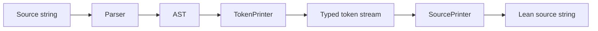
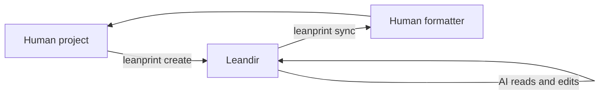
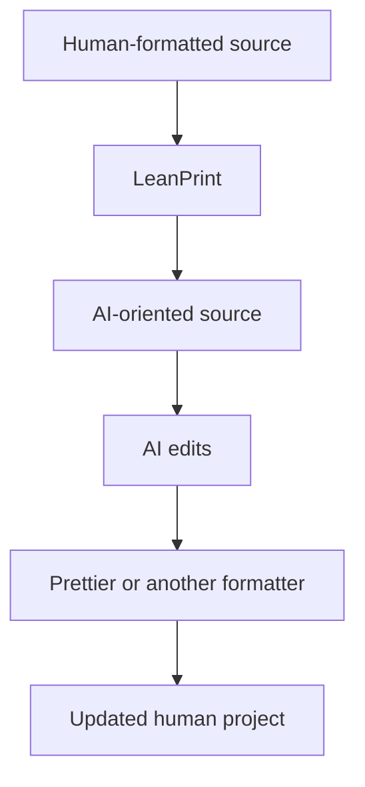

Implement LeanPrint as a production-quality TypeScript monorepo.

You may pause for design questions. Follow the decisions in this brief, ask when details are under-specified, contradictory or ambiguous, and document any remaining limitations.

# Project context

Large language models spend meaningful context and output tokens on source-code formatting that contributes little structural information.

Conventional formatters optimize source code for humans. Minifiers optimize for byte size and execution. LeanPrint occupies the space between them.

LeanPrint transforms valid source code into a compact, deterministic, still-readable representation intended for AI agents.

It removes optional formatting noise while preserving:

- program behavior
- parse structure
- indentation
- meaningful line boundaries
- comments
- lexical separation
- grammar-required parentheses
- grammar-required semicolons
- enough visual structure for humans and AI agents to edit the result safely

The initial format uses these defaults:

- two-space indentation
- no line wrapping
- no column limit
- no optional semicolons
- no trailing commas
- no optional horizontal whitespace
- no spaces around operators
- no spaces after control-flow keywords
- at most one consecutive empty line
- one statement per line by default
- simple single-statement control-flow bodies may be collapsed
- parentheses are emitted only when required to preserve syntax or expression structure

Example human-oriented input:

```ts
export function selectActiveUsers(
  users: readonly User[],
): readonly User[] {
  if (users.length === 0) {
    return [];
  }

  return users.filter((user) => {
    return user.active && user.email !== null;
  });
}
```

Expected LeanPrint-style output:

```ts
export function selectActiveUsers(users:readonly User[]):readonly User[]{
  if(users.length===0)return []
  return users.filter(user=>{
    return user.active&&user.email!==null
  })
}
```

LeanPrint is not reversible.

It intentionally discards formatting information such as wrapping, alignment, optional punctuation, blank-line placement, and optional grouping. It must never claim to decode its output back into the original source.

The intended workflow applies a conventional formatter when AI-authored changes are synchronized back to the human project.

# Product split

Create two npm packages in one monorepo.

```txt
leanprint
@leanprint/work
```

The packages have distinct responsibilities.

## `leanprint`

This is the source-to-source library.

It:

- accepts a source string
- derives the language from a filepath or accepts an explicit language
- parses the source
- emits a typed token stream from the AST
- converts that token stream to compact source
- returns the resulting string

It must not know about:

- directories
- filesystem traversal
- leandirs
- manifests
- AI sessions
- synchronization
- external human formatters
- Git
- CLI concerns

It exposes no executable in the MVP.

## `@leanprint/work`

This is the workflow and CLI package.

It depends on `leanprint`.

It provides:

- configuration discovery
- the `leanprint` executable
- direct file formatting
- leandir creation
- leandir synchronization
- conflict detection
- hashing and workspace metadata
- conventional formatter invocation
- AI prompt generation

The dependency direction must remain:

```txt
@leanprint/work -> leanprint
```

The library must never import from the workflow package.

# Project glossary

This glossary defines LeanPrint-specific vocabulary. Use these terms consistently and do not substitute neighboring terms when their meanings differ.

## LeanPrint

The project as a whole.

Depending on context, the name may also refer specifically to the source-to-source transformation performed by the `leanprint` package.

LeanPrint produces compact, deterministic, valid source code intended for AI consumption while preserving program behavior, parse structure, comments, and useful visual structure.

LeanPrint is not a minifier, conventional formatter, compressor, or reversible codec.

## `leanprint`

The unscoped npm package containing the source-to-source API.

It owns:

- language detection
- parser adapters
- AST-to-token conversion
- token-to-source conversion
- language-specific token and source configuration
- the `format()` API

It has no knowledge of filesystems, leandirs, synchronization, manifests, AI sessions, or human formatters.

## `@leanprint/work`

The npm package containing the user-facing workflow tools.

It depends on `leanprint` and owns:

- the `leanprint` executable
- config discovery
- file collection
- leandir creation
- synchronization
- conflict detection
- prompt generation
- token statistics
- human-formatter invocation

## Leanify

To transform ordinary valid source code into LeanPrint source using the `leanprint` API.

Example:

```ts
const leanSource=format(source,{
  filepath:"src/example.ts"
})
```

“Leanify” refers only to the source transformation. It does not mean copying a project, creating a leandir, running an AI agent, or synchronizing changes.

Preferred usage:

```txt
Leanify this file.
The file was leanified.
Leanification reduced the token count.
```

## Leanified source

Source code produced by LeanPrint.

Leanified source is:

- valid source code in its original programming language
- compact and deterministic
- intended primarily for AI reading and editing
- generally readable by humans
- not guaranteed to preserve original formatting choices

Do not call it encoded, compressed, decoded, or minified source.

## Human source

The source code stored in the source project and presented to human contributors.

Human source normally follows the project’s conventional formatting rules, such as Prettier, Biome, or dprint.

Human source is the canonical project representation.

## AI source

The leanified representation exposed to an AI agent inside a leandir.

AI source remains valid source code. It differs from human source only in representation, not intended behavior.

## Source project

The user’s original project containing human source.

The source project is the authoritative project tree. Synchronization writes accepted AI changes back into it after passing supported source files through the configured human formatter.

Do not call the source project the original project when that wording could imply that it becomes obsolete after synchronization.

## Source root

The absolute directory containing the active config file for the source project.

Ignore patterns, relative file paths, formatter execution, and leandir metadata are resolved relative to the source root unless explicitly documented otherwise.

## Leandir

A materialized AI-oriented working copy of the source project.

A leandir contains:

- leanified versions of supported source files
- unchanged copies of unsupported files
- generated workspace metadata
- a generated form of the active config file

An AI agent works inside the leandir rather than directly in the source project.

A leandir is not:

- a mount
- a FUSE filesystem
- a Git worktree
- a live mirror
- a cache
- a reversible encoding
- continuously synchronized

Use `leandir` as one lowercase word in prose, JSON keys, identifiers, and CLI output where normal casing permits.

Examples:

```txt
Create a leandir.
The current directory is a leandir.
Synchronize the leandir.
```

## Leandir root

The top-level absolute directory of a leandir.

It contains the generated config file and corresponds to one source root.

## Config file

The project configuration file discovered and read by `@leanprint/work`.

Its default repository-relative filename is `leanprint.json`

Users may select another repository-relative filename with the global `-c` option.

Examples:

```sh
leanprint create
leanprint -c config/ai-format.json create
leanprint -c tools/leanprint.json stats tiktoken gpt-4o
```

The configured filename:

- its dirname determines the source root (so it is by construction always within the project).
- is used consistently when discovering both source projects and leandirs

Do not hardcode `leanprint.json` anywhere except as the default value.

Functions and types should refer to the concept as `configFile`, `configPath`, or `configFilename`, depending on whether they hold a file, absolute path, or repository-relative filename.

## Source config file

The user-owned config file inside the source project.

It defines settings such as:

- `leandir`
- ignore patterns
- parser configuration
- token configuration
- source configuration
- human formatter configuration

It must not contain generated workspace state.

## Generated config file

The generated counterpart of the active config file inside the leandir.

It uses the same leandir-relative filename selected by `-c`, or `leanprint.json` by default.

It contains:

- the resolved session configuration
- generated workspace metadata
- source and leandir locations
- recorded file state
- schema and tool versions

The generated config file is owned by `@leanprint/work`.

AI edits to it are ignored, rejected, or replaced according to the workspace-integrity rules. It is never synchronized back over the source config file.

## Config filename

The repository-relative filename used to locate the config file.

Default:

```txt
leanprint.json
```

Example alternative:

```txt
tools/leanprint.config.json
```

The CLI `-c` option sets the config filename, not an arbitrary absolute config path.

## Config discovery

The process of locating the active config file.

Starting from the requested path or current directory:

1. resolve the selected config filename
2. inspect the current directory for that relative filename
3. walk upward one directory at a time
4. stop when the config file is found
5. otherwise fail at the filesystem root

When the selected config filename contains directories, test the full relative filename at each candidate root.

For example:

```sh
leanprint -c tools/lean.json status
```

searches for:

```txt
<candidate-root>/tools/lean.json
```

at each level.

## Resolved config

The complete validated configuration used by a command after applying:

- defaults
- source config values
- command-line overrides
- language defaults where applicable

Prompt generation, leanification, statistics, and leandir metadata must use the resolved config rather than independently interpreting partial settings.

## Workspace metadata

Generated state stored under the reserved `workspace` key in the generated config file.

It records information needed by later commands, including:

- workspace schema version
- tool version
- source root
- leandir root
- config filename
- resolved configuration or its relevant session form
- creation time
- config hash
- file records
- integrity information

Workspace metadata is trusted only after validation.

## File record

The workspace metadata entry describing one path captured during leandir creation.

A file record may contain:

- repository-relative path
- entry kind
- source hash
- initial leandir hash
- whether the file was leanified
- file mode
- other synchronization metadata

## Manifest

The complete collection of recorded file states inside workspace metadata.

The manifest is a concept, not a separate required file.

Do not introduce an additional manifest filename for the MVP. Store manifest data inside the generated config file under `workspace`.

## Leanifiable file

A regular source file that:

- is not ignored
- has a supported language or extension
- can be parsed by the selected language parser
- is eligible for transformation by LeanPrint

A supported extension alone does not guarantee successful leanification. Parse failures must be reported.

## Supported file

A file whose language can be resolved to an installed LeanPrint language domain.

In the MVP, supported files are JavaScript, JSX, TypeScript, and TSX files using the configured ECMAScript domain.

Depending on context, “supported file” may include a file that later fails to parse. Use “leanifiable file” after successful parsing and eligibility are established.

## Ignored path

A source-root-relative path excluded by the active config.

Ignored paths are not:

- copied into the leandir
- leanified
- included in token statistics
- recorded as ordinary workspace files
- synchronized

Ignore behavior comes only from LeanPrint configuration in the MVP. Do not read `.gitignore`.

## Language domain

A self-contained implementation for one programming-language family.

A language domain owns its:

- parser adapter
- AST types
- token vocabulary
- TokenPrinter
- SourcePrinter
- precedence rules
- parenthesis rules
- lexical-spacing rules
- statement-termination rules

The initial language domain is `ecmascript`, covering JavaScript, JSX, TypeScript, and TSX.

“Language-independent” describes the architecture and interfaces. It does not imply extensive helper sharing among language domains.

## Parser

A language-domain adapter that transforms a source string into that domain’s AST.

The parser does not print source, create tokens, traverse directories, or manage leandirs.

## Token

A typed item emitted by a TokenPrinter.

Fixed syntax tokens use their source lexeme as their token type where practical:

```ts
{type:"if"}
{type:"&&"}
{type:"("}
```

Dynamic tokens carry typed payloads:

```ts
{type:"ident",value:"account"}
{type:"string",value:"hello"}
```

A token is not an arbitrary source fragment.

## Concrete token

A token that maps to source text.

Examples include:

- keywords
- identifiers
- literals
- operators
- punctuation
- comments

Concrete tokens participate in lexical-adjacency decisions.

## Virtual token

A token that does not directly map to source text.

Virtual tokens communicate structural or grammatical context to the SourcePrinter.

Examples include:

- statement boundaries
- line requests
- indentation changes
- dedentation changes

A virtual token may influence spaces, newlines, indentation, or semicolon emission.

## Token family

A set of token types grouped primarily by lexical-emission behavior.

Initial families include:

- `Word`
- `Symbol`
- `Virtual`

These are not intended as complete semantic classifications.

Exact token-pair rules may override family defaults.

## Word token

A concrete token belonging to the word-like lexical family.

Two adjacent word tokens generally require whitespace so they do not merge into one lexical token.

Keywords, identifiers, and some literal forms may behave as word tokens.

## Symbol token

A concrete punctuation or operator token that can often touch neighboring tokens.

Symbol tokens are not universally safe to concatenate. Exact pairs must still be checked to prevent accidental creation of another operator, punctuator, or comment opener.

## TokenPrinter

The language-specific AST-to-token stage.

A TokenPrinter:

- walks the AST
- emits typed tokens
- applies precedence rules
- emits grammar-required parentheses
- decides whether optional braces may be removed
- emits structural virtual tokens
- preserves comments
- records statement boundaries

A TokenPrinter never emits untyped source strings and never controls physical whitespace.

## SourcePrinter

The language-specific token-to-source stage.

A SourcePrinter:

- receives typed tokens
- maps concrete tokens to text
- resolves lexical spacing
- writes indentation
- writes physical line endings
- limits empty lines
- resolves statement boundaries
- emits required or defensive semicolons

A SourcePrinter never receives the AST or original source string.

## Statement boundary

A virtual token indicating that one syntactic statement has ended.

It is not itself a semicolon.

The SourcePrinter resolves a statement boundary into the source representation required by the active configuration and surrounding concrete tokens.

Possible results include:

- no direct text
- a newline
- a semicolon
- a semicolon followed by a newline

## ASI protection

The ECMAScript-specific logic that prevents omitted semicolons and line layout from changing the program’s parse.

ASI protection may emit a semicolon even when optional semicolons are disabled.

The setting `semicolons:false` means “omit optional semicolons,” not “forbid every semicolon character.”

## Required parentheses

Parentheses that must be emitted to:

- preserve the AST’s expression structure
- satisfy language grammar
- prevent a surrounding construct from parsing differently

LeanPrint does not preserve optional source parentheses merely because the author wrote them.

## Human formatter

The external conventional formatter applied when supported AI-edited source is synchronized into the source project.

Examples include:

- Prettier
- Biome
- dprint

The human formatter is not an inverse LeanPrint transform. It creates the project’s desired human representation from valid AI-edited source.

## Create

The workflow operation that materializes a new leandir from a source project.

Creation:

- discovers and resolves configuration
- copies eligible project files
- leanifies supported source
- records initial source and leandir state
- writes generated workspace metadata

The CLI command is:

```sh
leanprint create
```

## Sync

The workflow operation that transfers completed AI changes from a leandir back to its source project.

Synchronization:

- computes leandir changes
- checks whether corresponding source paths changed
- reports conflicts
- runs the human formatter for supported source
- applies safe additions, modifications, and deletions atomically

Sync is not continuous and does not refresh the leandir from the source project.

The CLI command is:

```sh
leanprint sync
```

## Conflict

A path that cannot be synchronized safely because both the source project and leandir changed incompatibly after leandir creation.

Examples include:

- the same existing file changed on both sides
- the leandir deleted a file changed in the source project
- both sides independently added the same path

When any conflict exists, the default synchronization operation writes nothing.

## Source hash

The SHA-256 hash of the exact human-source file bytes recorded during leandir creation.

It is used to determine whether the source project changed during the AI session.

## Lean hash

The SHA-256 hash of the initial file bytes written into the leandir.

For a leanifiable file, this hashes the leanified source.

For an unchanged copied file, it normally matches the source hash.

It is used to determine whether the AI changed the leandir file.

## Prompt

The deterministic English instruction text generated from the resolved config for an AI agent working inside a leandir.

The prompt explains the active compact-source rules and warns the agent not to:

- apply conventional human formatting
- edit generated config or workspace metadata
- expect LeanPrint to restore original formatting

The CLI command is:

```sh
leanprint prompt
```

## Stats

Read-only analysis measuring the effects of LeanPrint over all leanifiable project files.

Stats does not create a leandir or modify source files.

The initial backend is invoked as:

```sh
leanprint stats tiktoken [model-or-encoding]
```

## Stats backend

A tokenizer-specific implementation beneath the `stats` command.

The backend namespace allows future tokenizers to coexist without changing the top-level command.

The MVP backend is `tiktoken`.

## Original token count

The total number of tokenizer tokens across human-source inputs before leanification.

## Lean token count

The total number of tokenizer tokens across the corresponding leanified outputs.

## Token savings

The signed difference:

```ts
originalTokenCount-leanTokenCount
```

A negative value means LeanPrint increased the token count for the selected tokenizer.

## Reduction percentage

The signed percentage of original tokens removed:

```ts
originalTokenCount===0
  ?0
  :tokenSavings/originalTokenCount*100
```

## Format

A direct source-to-source operation over one file or source string.

At the library level:

```ts
format(source,options)
```

At the CLI level:

```sh
leanprint format src/example.ts
leanprint format src/example.ts --write
```

Format does not create workspace metadata or participate in synchronization.

## Workspace session

The period beginning when a leandir is created and ending when it is synchronized or discarded.

The MVP assumes the source project remains unchanged during the workspace session. Concurrent changes are detected during sync rather than propagated live.

## Workspace integrity

Validation that generated workspace metadata is complete, internally consistent, and still corresponds to the expected source project and leandir.

Invalid workspace integrity must cause a safe failure. The tool must not infer missing roots or synchronization state from surrounding files.

# Vocabulary rules

Use the glossary terms exactly in public APIs, documentation, CLI help, tests, and diagnostics.

In particular:

- Say “leanify,” not “encode.”
- Say “human formatter,” not “decoder.”
- Say “leandir,” not “mount,” “mirror,” or “worktree.”
- Say “source project,” not “host copy.”
- Say “generated config file,” not “manifest file.”
- Say “workspace metadata” for the generated state under `workspace`.
- Say “config file” when its filename may be changed with `-c`.
- Mention `leanprint.json` only as the default config filename or in a concrete example using that default.
- Do not assume the config filename is at the repository root without accounting for directory components selected through `-c`.

# Monorepo

Use:

- pnpm as the package manager
- pnpm workspaces
- Strict TypeScript
- ESLint and typescript eslint
- ESM
- Node.js 24 or newer
- Changesets
- a small build tool such as tsup
- @commander-js/extra-typings for the CLI

Suggested repository layout (just a general direction; you can freely modify it to the project's specific requirements):

```txt
leanprint/
  eslint.config.ts
  package.json
  pnpm-workspace.yaml
  tsconfig.json
  .changeset/
  .github/
    workflows/
      ci.yml

  packages/
    leanprint/
      package.json
      tsconfig.json
      src/
        index.ts
        api.ts
        types.ts

        ecmascript/
          index.ts
          Parser.ts
          TokenPrinter.ts
          SourcePrinter.ts
          tokens.ts
          parentheses.ts
          types.ts

      test/
        api.test.ts
        fixtures/
        ecmascript/
          Parser.test.ts
          TokenPrinter.test.ts
          SourcePrinter.test.ts
          parentheses.test.ts
          equivalence.test.ts
          idempotence.test.ts

    work/
      package.json
      tsconfig.json
      src/
        index.ts
        cli.ts
        Config.ts
        Leandir.ts
        Manifest.ts
        Formatter.ts
        Prompt.ts
        filesystem.ts
        hash.ts
        types.ts

      test/
        create.test.ts
        sync.test.ts
        conflicts.test.ts
        prompt.test.ts
        fixtures/
```

PascalCase implementation files default-export the corresponding main class.

For example:

```ts
export default class SourcePrinter{
}
```

Lowercase files contain supporting functions, constants, and types.

The root package is private.

Suggested root scripts:

```json
{
  "private":true,
  "scripts":{
    "build":"pnpm -r build",
    "test":"pnpm -r test",
    "typecheck":"pnpm -r typecheck",
    "lint":"pnpm -r lint",
    "ci":"pnpm typecheck && pnpm test && pnpm build",
    "changeset":"changeset",
    "version-packages":"changeset version",
    "release":"pnpm build && changeset publish"
  }
}
```

The workflow package uses the local core package during development:

```json
{
  "dependencies":{
    "leanprint":"workspace:*"
  }
}
```

For the initial releases, keep both package versions synchronized.

# Architecture

The source transformation pipeline is:



The workspace flow is:



LeanPrint is a one-way projection:



There is no decode operation.

# Language-independent contracts

Define small generic interfaces in `packages/leanprint/src/types.ts`.

The common layer must not define universal syntax tokens or universal AST shapes.

Suggested contracts:

```ts
export interface Parser<Ast,Config=undefined>{
  parse(source:string,config:Config):Ast
}

export interface TokenPrinter<Ast,Token,Config=undefined>{
  print(ast:Ast,config:Config):Iterable<Token>
}

export interface SourcePrinter<Token,Config=undefined>{
  print(tokens:Iterable<Token>,config:Config):string
}

export interface Language<
  Ast,
  Token,
  ParserConfig,
  TokenConfig,
  SourceConfig
>{
  readonly id:string
  readonly extensions:readonly string[]
  readonly parser:Parser<Ast,ParserConfig>
  readonly tokenPrinter:TokenPrinter<Ast,Token,TokenConfig>
  readonly sourcePrinter:SourcePrinter<Token,SourceConfig>
  readonly defaults:{
    parser:ParserConfig
    tokens:TokenConfig
    source:SourceConfig
  }
}
```

The exact generic layout may be adjusted when useful, but retain these boundaries.

The source printer is language-specific. Do not create one universal source printer containing a forest of language hooks.

Each language owns its parser adapter, token vocabulary, AST printer, lexical spacing rules, statement termination rules, and grammar exceptions.

Avoid helper sharing between language domains unless a later language demonstrates a real shared need.

# Public `leanprint` API

Expose a compact synchronous API.

```ts
import {format} from "leanprint"

const output=format(source,{
  filepath:"src/example.ts",
  tokens:{
    semicolons:false,
    trailingCommas:false,
    collapseSingleStatementBlocks:true,
    parentheses:"required-only"
  },
  source:{
    indent:2,
    lineWrapping:false,
    maxEmptyLines:1,
    spaceAroundOperators:false,
    spaceAfterControlKeywords:false
  }
})
```

Suggested API types:

```ts
export interface FormatOptions{
  filepath?:string
  language?:string
  parser?:Record<string,unknown>
  tokens?:Record<string,unknown>
  source?:Record<string,unknown>
}

export function format(
  source:string,
  options:FormatOptions
):string
```

Also expose lower-level pieces for advanced consumers:

```ts
export {
  defineLanguage,
  getLanguage,
  registerLanguage
}

export {
  ecmascript
}
```

Language resolution rules:

1. Use `options.language` when provided.
2. Otherwise derive the language from `options.filepath`.
3. Throw a descriptive error if neither can determine a language.
4. Throw a descriptive error for an unsupported extension.

Do not silently return the original input when language resolution or printing fails.

# ECMAScript parser

Use `@babel/parser` as the parser dependency for the MVP.

Support:

- `.js`
- `.jsx`
- `.mjs`
- `.cjs`
- `.ts`
- `.tsx`
- `.mts`
- `.cts`

Select parser plugins from the filepath.

The parser adapter should:

- use `sourceType:"unambiguous"` by default
- support JavaScript, TypeScript, JSX, and TSX
- preserve comments
- expose useful parse errors with filepath, line, and column
- remain thin
- avoid source transformation or workspace behavior

Do not depend on Babel's code generator.

Do not use Prettier, Recast, astring, escodegen, or another full printer to generate LeanPrint output.

# ECMAScript token model

Use string-literal token types rather than enums.

Fixed syntax tokens should use their actual spelling as their type.

Examples:

```ts
type FixedTokenType=
  |"if"
  |"else"
  |"for"
  |"return"
  |"function"
  |"class"
  |"const"
  |"let"
  |"var"
  |"&&"
  |"||"
  |"??"
  |"=>"
  |"+"
  |"-"
  |"*"
  |"/"
  |"("
  |")"
  |"["
  |"]"
  |"{"
  |"}"
  |"."
  |","
  |":"
  |";"
```

The complete union should cover every fixed token emitted by the supported printer.

Dynamic tokens use structured payloads:

```ts
type Token=
  |{type:FixedTokenType}
  |{type:"ident";value:string}
  |{type:"private-ident";value:string}
  |{type:"number";value:string}
  |{type:"bigint";value:string}
  |{type:"string";value:string}
  |{type:"regex";pattern:string;flags:string}
  |{type:"template-chunk";value:string}
  |{type:"comment";kind:"line"|"block";value:string}
  |{type:"statement-boundary";mode:"normal"|"required"}
  |{type:"line";kind:"soft"|"hard"}
  |{type:"indent"}
  |{type:"dedent"}
```

Adjust the union as implementation requires.

Do not introduce a generic token such as:

```ts
{type:"raw",value:string}
```

The TokenPrinter must never bypass the token model by emitting arbitrary source fragments.

Dynamic strings are allowed only as payloads for defined lexical token kinds such as identifiers, literals, template chunks, and comments.

Expose token-family arrays, sets, and type guards from `tokens.ts`.

The main initial families are based on lexical spacing behavior:

```ts
Word
Symbol
Virtual
```

These are not primarily semantic categories.

Examples:

- `Word` tokens generally require whitespace when adjacent to another word-like token.
- `Symbol` tokens can usually touch other tokens.
- `Virtual` tokens do not directly map to source text and instead carry layout or grammar context.

Provide exports similar to:

```ts
export const wordTokenTypes=[...] as const
export const symbolTokenTypes=[...] as const
export const virtualTokenTypes=[...] as const

export type WordTokenType=typeof wordTokenTypes[number]
export type SymbolTokenType=typeof symbolTokenTypes[number]
export type VirtualTokenType=typeof virtualTokenTypes[number]

export function isWordToken(token:Token):token is WordToken
export function isSymbolToken(token:Token):token is SymbolToken
export function isVirtualToken(token:Token):token is VirtualToken
```

Do not assume that every pair of symbol tokens can be concatenated.

Examples of unsafe concatenation include cases that could create:

- `++`
- `--`
- `//`
- `/*`
- `<<`
- `>>`
- `?.`
- a different punctuator
- a comment opener
- a different lexical token

The ECMAScript SourcePrinter must use exact adjacent token types for exceptions.

# ECMAScript TokenPrinter

`TokenPrinter.ts` walks the AST and emits only typed tokens.

It owns:

- AST traversal
- syntax selection
- operator precedence
- associativity
- required parentheses
- optional brace removal
- trailing comma removal
- statement boundaries
- structural line and indentation tokens
- comment placement
- TypeScript syntax emission

It does not own:

- physical spaces
- indentation strings
- newline characters
- line-ending style
- token-to-text mapping
- final ASI rendering

Use generator methods where practical:

```ts
export default class TokenPrinter{
  *print(ast:Program,config:TokenPrinterConfig):Iterable<Token>{
    yield* this.printProgram(ast)
  }
}
```

A dispatch method may route by AST node type:

```ts
private *printNode(node:Node,context:PrintContext):Iterable<Token>
```

Unsupported nodes must produce an explicit error containing:

- AST node type
- filepath when known
- source location when known

Never silently skip an unsupported node.

Never silently fall back to another code generator.

# Parentheses

Create `ecmascript/parentheses.ts`.

Original source parentheses are not authoritative.

Ignore parser metadata that merely records original optional parentheses. Recreate grouping from the AST.

Emit parentheses only when required to:

1. preserve the parsed expression tree
2. satisfy ECMAScript grammar
3. satisfy TypeScript grammar
4. prevent a surrounding construct from parsing the expression differently

Use a precedence table plus explicit grammar exceptions.

The basic comparison is:

```ts
if(childPrecedence<parentPrecedence)return true
if(childPrecedence>parentPrecedence)return false
```

Equal precedence must account for:

- child position
- left or right associativity
- exact operator pairing
- non-associative tree shapes
- JavaScript `+` string behavior
- exponentiation
- assignment
- conditional expressions
- sequence expressions

Do not apply algebraic transformations.

For example:

```ts
a+(b+c)
```

must not become:

```ts
a+b+c
```

because JavaScript addition may perform string concatenation.

Include explicit rules and tests for at least:

- right child of left-associative operators
- left child of exponentiation
- unary expressions on the left of `**`
- mixing `??` with `&&` or `||`
- arrow functions
- assignment expressions
- conditional expressions
- sequence expressions
- call and member positions
- `new`
- optional chaining
- TypeScript `as`
- TypeScript `satisfies`
- TypeScript non-null assertions
- TypeScript type assertions
- JSX where supported

A useful API is:

```ts
export function needsParentheses(
  child:Expression,
  parent:Node,
  position:ExpressionPosition
):boolean
```

Keep precedence and grammar logic independently testable.

# Optional brace removal

Brace removal belongs in the TokenPrinter because it requires AST and grammar knowledge.

When `collapseSingleStatementBlocks` is enabled, conservatively collapse simple control-flow bodies.

Examples:

```ts
if(!value){
  return null
}
```

may become:

```ts
if(!value)return null
```

Do not remove braces when doing so could:

- create a dangling-`else` ambiguity
- make a declaration invalid
- change lexical scope
- move or detach comments
- affect directives
- obscure nested control flow
- alter behavior
- produce invalid TypeScript or JavaScript

For the MVP, keeping braces in uncertain cases is correct.

Correctness takes priority over removing one more token.

# SourcePrinter

`SourcePrinter.ts` receives only the ECMAScript token stream.

It never receives the AST or the original source.

It owns:

- fixed token spelling
- rendering dynamic token payloads
- horizontal spacing
- indentation
- physical newlines
- empty-line limits
- lexical separator insertion
- statement-boundary realization
- ASI protection
- output buffering

It should support streaming input, but it may buffer a small number of tokens for lookahead.

A practical design is to track:

- previous concrete token
- pending virtual tokens
- next concrete token
- current indentation depth
- whether the current line has content
- current empty-line count

Virtual tokens may be accumulated until the next concrete token makes the separator decision possible.

The printer should choose among:

```ts
type Separator=""|" "|"\n"|";"|";\n"
```

The actual internal representation may differ.

# Lexical spacing

Implement a function such as:

```ts
function requiredSeparator(
  previous:ConcreteToken,
  next:ConcreteToken
):""|" "
```

Broad defaults may use token families:

```txt
Word + Word       -> space
Word + Symbol     -> none
Symbol + Word     -> none
Symbol + Symbol   -> none by default
```

Exact-token exceptions override the defaults.

The output must never accidentally merge two intended tokens into a different token.

Test symbol pairs extensively.

No optional horizontal space should be emitted unless configured or required for lexical correctness.

With default settings:

```ts
if (a && b) {
```

becomes:

```ts
if(a&&b){
```

Word separation remains when required:

```ts
return typeof value
```

must not become:

```ts
returntypeofvalue
```

# ASI and semicolons

Do not look for a generic npm library to apply automatic semicolon insertion.

Implement ECMAScript statement-boundary logic in the ECMAScript SourcePrinter, supported by metadata from the TokenPrinter.

The TokenPrinter emits a virtual statement boundary instead of directly emitting an optional semicolon.

Example:

```ts
{type:"statement-boundary",mode:"normal"}
```

The SourcePrinter decides whether that boundary becomes:

- a newline
- a semicolon
- a semicolon followed by a newline
- no output in a grammar-safe inline context

This decision may depend on:

- whether a physical line break will be emitted
- the previous concrete token
- the next concrete token
- whether the next token can continue the previous statement
- whether the grammar requires an explicit semicolon
- restricted productions

The SourcePrinter may use exact-token hazard tables and limited lookahead.

Cover classic hazards involving statements beginning with:

- `(`
- `[`
- template literals
- regular-expression literals
- unary `+`
- unary `-`

Also test:

- `return`
- `throw`
- `break`
- `continue`
- `yield`
- `async`
- postfix update expressions
- class fields where relevant
- empty statements
- `do...while`

With `semicolons:false`, omit semicolons wherever safe, but still emit defensive or required semicolons.

The setting means “omit optional semicolons,” not “never print the semicolon character.”

# Comments

Preserve comments.

The initial implementation does not need to preserve exact comment columns or original blank-line layout.

It must preserve:

- comment text
- comment order
- association with the relevant construct
- line comments as line comments
- block comments as block comments
- shebangs
- important comments such as license banners

A line comment must force a line break after it.

Do not place generated code after a line comment on the same line.

Comment placement must not alter program behavior.

# Default configuration

Define typed defaults for ECMAScript.

```ts
export interface EcmascriptTokenConfig{
  semicolons:boolean
  trailingCommas:boolean
  collapseSingleStatementBlocks:boolean
  parentheses:"required-only"
}

export interface EcmascriptSourceConfig{
  indent:number
  lineWrapping:boolean
  maxEmptyLines:number
  spaceAroundOperators:boolean
  spaceAfterControlKeywords:boolean
  lineEnding:"lf"|"crlf"
}
```

Default values:

```json
{
  "tokens":{
    "semicolons":false,
    "trailingCommas":false,
    "collapseSingleStatementBlocks":true,
    "parentheses":"required-only"
  },
  "source":{
    "indent":2,
    "lineWrapping":false,
    "maxEmptyLines":1,
    "spaceAroundOperators":false,
    "spaceAfterControlKeywords":false,
    "lineEnding":"lf"
  }
}
```

Validate configuration and reject invalid values with useful messages.

# `@leanprint/work` CLI

The package `@leanprint/work` owns the executable named `leanprint`.

Its package manifest should contain:

```json
{
  "name":"@leanprint/work",
  "bin":{
    "leanprint":"dist/cli.js"
  }
}
```

This is intentional:

- JavaScript consumers import the `leanprint` library.
- End users install `@leanprint/work` and run the `leanprint` command.

Implement these MVP commands:

```sh
leanprint format <file>
leanprint format <file> --write
leanprint create [root]
leanprint sync [path]
leanprint prompt [path]
leanprint status [path]
leanprint clean [path]
leanprint stats tiktoken [model]
```

Common options:

-c,--config <filename> (default leanprint.json) : determines the config file location.

Required behavior:

## `format`

Read one supported source file, invoke the core library, and print to stdout.

With `--write`, replace the file atomically.

Allow:

```sh
leanprint format src/example.ts
leanprint format src/example.ts --write
leanprint format src/example.ts --language ecmascript
```

## `create`

Discover the config file, copy the source project to the configured leandir, transform supported source files, and write generated workspace metadata.

## `sync`

Detect changes made in the leandir, detect conflicts, pass changed supported source through the configured human formatter, and atomically update the source project.

## `prompt`

Print deterministic English instructions describing the active LeanPrint format.

Write only the generated prompt to stdout so it can be redirected or copied.

## `status`

Show:

- source root
- leandir path
- number of changed files
- number of added files
- number of deleted files
- conflicts
- whether the current directory is a source project or leandir

## `clean`

Delete the leandir only after verifying that it is the generated directory recorded by the workspace metadata.

Require confirmation unless `--force` is supplied.

## `stats`

Initial CLI shape:

```sh
leanprint stats tiktoken [model]
```

Examples:

```sh
leanprint stats tiktoken gpt-4o
leanprint stats tiktoken o200k_base
leanprint stats tiktoken
```

The `stats` command is intentionally namespaced by tokenizer backend so other tokenization systems can be added later without changing the command structure.

Possible future backends might include:

```sh
leanprint stats anthropic
leanprint stats sentencepiece
leanprint stats custom
```

Only `tiktoken` is part of the MVP.

## Purpose

The command measures how many model tokens LeanPrint saves across a project.

It must:

1. discover the project's config file
2. resolve the active configuration
3. collect every supported, non-ignored source file
4. read each original source file
5. transform it with the `leanprint` library
6. tokenize both the original and leanified forms
7. sum the totals
8. report absolute and percentage savings

It must not modify any files or create a leandir.

## Tokenizer dependency

Use the npm `tiktoken` package.

Resolve the tokenizer from the user-provided model or encoding argument.

Prefer model-aware resolution where supported:

```ts
encoding_for_model(model)
```

When the argument names an encoding directly, use:

```ts
get_encoding(encoding)
```

Accept common encoding names such as:

```txt
o200k_base
cl100k_base
p50k_base
r50k_base
```

If no model or encoding is provided, use a documented default appropriate for current GPT-family code measurements.

Keep tokenizer resolution in a dedicated adapter so the command is not coupled directly to one package API.

Suggested structure:

```txt
packages/work/src/
  stats/
    Stats.ts
    Tiktoken.ts
    types.ts
```

`Tiktoken.ts` should own:

- loading the npm tokenizer
- model-to-encoding resolution
- direct encoding-name resolution
- encoding source strings
- releasing tokenizer resources when required
- converting tokenizer failures into useful CLI errors

## CLI behavior

Add:

```sh
leanprint stats tiktoken [model-or-encoding]
```

Optional useful flags:

```sh
leanprint stats tiktoken gpt-4o --json
leanprint stats tiktoken cl100k_base --root ./project
```

Only aggregate output is required for the MVP.

Default human-readable output:

```txt
Tokenizer: gpt-4o
Encoding: o200k_base
Files: 147

Original tokens: 382,410
LeanPrint tokens: 286,772
Tokens saved: 95,638
Reduction: 25.01%
```

Calculate reduction as:

```ts
const saved=originalTokens-leanTokens
const percentage=originalTokens===0
  ?0
  :saved/originalTokens*100
```

Do not assume LeanPrint always reduces the token count.

When the transformed output has more tokens, report the signed result honestly:

```txt
Tokens saved: -214
Reduction: -0.42%
```

For `--json`, emit machine-readable output only:

```json
{
  "backend":"tiktoken",
  "requested":"gpt-4o",
  "encoding":"o200k_base",
  "files":147,
  "originalTokens":382410,
  "leanTokens":286772,
  "tokensSaved":95638,
  "reductionPercentage":25.01
}
```

## File collection

Use the same language detection, supported extensions, root discovery, and ignore rules as `leanprint create`.

The command must analyze source-project files, not generated leandir files.

When invoked inside a leandir:

1. read the generated workspace metadata
2. locate `workspace.sourceRoot`
3. load the source project configuration
4. analyze the source project

Exclude:

- ignored paths
- unsupported files
- generated leandir metadata
- the configured leandir itself
- unreadable files, unless an explicit error policy is later added

For the MVP, an unreadable supported file should fail the command with its path rather than silently reducing the file count.

## Processing model

For each supported file:

```ts
const source=readFile(path,"utf8")
const lean=format(source,{
  filepath:path,
  parser:config.parser,
  tokens:config.tokens,
  source:config.source
})

const originalCount=encoding.encode(source).length
const leanCount=encoding.encode(lean).length
```

Accumulate counts without retaining all source strings or encoded token arrays.

Process files sequentially for the first implementation unless profiling demonstrates a need for concurrency.

Do not cache results in the MVP.

Do not write leanified output to disk.

## Public workflow API

Expose a programmatic API from `@leanprint/work`:

```ts
export interface TiktokenStatsOptions{
  root:string
  modelOrEncoding?:string
}

export interface TokenStats{
  backend:"tiktoken"
  requested:string
  encoding:string
  files:number
  originalTokens:number
  leanTokens:number
  tokensSaved:number
  reductionPercentage:number
}

export function getTiktokenStats(
  options:TiktokenStatsOptions
):Promise<TokenStats>
```

The exact naming may vary, but keep the tokenizer backend visible in the API.

## Error handling

Add useful failures for:

- unknown model
- unknown encoding
- missing tokenizer resources
- invalid project configuration
- unsupported or unparseable source files
- unreadable files
- invocation from a path with no discoverable project

When model-aware resolution fails, the error should mention that the user may provide an encoding name directly.

Example:

```txt
Could not resolve tokenizer for "example-model".
Provide a supported model name or an encoding such as "o200k_base".
```

## Tests

Add tests for:

- model resolution
- direct encoding resolution
- default resolution
- aggregate token counting
- ignore rules
- supported-file filtering
- invocation from the source project
- invocation from a leandir
- zero-token projects
- negative savings
- JSON output
- parse failures
- unknown models and encodings
- no filesystem modifications

Use small deterministic fixtures and assert totals computed by the actual tokenizer package.

## Future extensions

Design the internal result model so later releases can add:

- per-file results
- per-directory summaries
- largest absolute savings
- largest percentage savings
- file-type summaries
- token-frequency changes
- most removed token sequences
- configuration comparisons
- multiple tokenizer comparisons
- CSV or JSON reports
- before-and-after histograms

Do not implement these in the MVP.

The initial command answers one question clearly:

> Across this project and tokenizer, how many tokens does LeanPrint save?

# Source-project configuration

The source project root contains the config file.

Example:

```json
{
  "leandir":"/tmp/example-project.lean",
  "ignore":[
    ".git/**",
    "node_modules/**",
    "dist/**",
    "coverage/**"
  ],
  "tokens":{
    "semicolons":false,
    "trailingCommas":false,
    "collapseSingleStatementBlocks":true,
    "parentheses":"required-only"
  },
  "source":{
    "indent":2,
    "lineWrapping":false,
    "maxEmptyLines":1,
    "spaceAroundOperators":false,
    "spaceAfterControlKeywords":false,
    "lineEnding":"lf"
  },
  "humanFormatter":{
    "command":"pnpm",
    "args":[
      "exec",
      "prettier",
      "--stdin-filepath",
      "{file}"
    ]
  }
}
```

Configuration discovery:

1. Start from the requested path or current directory.
2. Walk upward until the config file is found.
3. Stop at the filesystem root.
4. The directory containing the file is the source root or leandir root.

Ignore patterns:

- are explicit glob patterns
- are evaluated relative to the source root
- use forward-slash relative paths internally
- do not read `.gitignore`
- do not depend on Git

Use node glob.

The configured leandir must not be:

- the source root
- inside the source root
- an ancestor of the source root

Resolve real paths before validating this.

# Generated leandir configuration and metadata

The leandir also contains a generated `leanprint.json`.

In the source project, `leanprint.json` is user-owned configuration.

In the leandir, `leanprint.json` is generated workspace state.

The generated file contains:

- the resolved configuration used for the session
- a reserved `workspace` key
- the source root
- the leandir path
- tool and schema versions
- creation time
- file hashes
- transformation metadata

Example:

```json
{
  "leandir":"/tmp/example-project.lean",
  "ignore":[
    ".git/**",
    "node_modules/**",
    "dist/**",
    "coverage/**"
  ],
  "tokens":{
    "semicolons":false,
    "trailingCommas":false,
    "collapseSingleStatementBlocks":true,
    "parentheses":"required-only"
  },
  "source":{
    "indent":2,
    "lineWrapping":false,
    "maxEmptyLines":1,
    "spaceAroundOperators":false,
    "spaceAfterControlKeywords":false,
    "lineEnding":"lf"
  },
  "humanFormatter":{
    "command":"pnpm",
    "args":[
      "exec",
      "prettier",
      "--stdin-filepath",
      "{file}"
    ]
  },
  "workspace":{
    "schemaVersion":1,
    "toolVersion":"0.1.0",
    "sourceRoot":"/home/user/example-project",
    "leandir":"/tmp/example-project.lean",
    "createdAt":"2026-07-26T10:20:00.000Z",
    "configHash":"sha256:...",
    "files":{
      "src/index.ts":{
        "kind":"file",
        "sourceHash":"sha256:...",
        "leanHash":"sha256:...",
        "transformed":true,
        "mode":420
      },
      "package.json":{
        "kind":"file",
        "sourceHash":"sha256:...",
        "leanHash":"sha256:...",
        "transformed":false,
        "mode":420
      }
    }
  }
}
```

The presence of a valid `workspace` key tells the CLI it is running in a leandir.

The generated `leanprint.json` is not synchronized back to the source project.

Top-level edits to the generated copy are ignored during synchronization.

Protect the reserved `workspace` metadata from accidental modification by storing and validating an integrity hash over the workspace state, excluding the integrity field itself.

If reserved metadata is missing or invalid, fail safely rather than guessing the source path.

After a successful sync, regenerate the leandir's `leanprint.json` from trusted state.

# Leandir creation

Implement `leanprint create` as a materialized workspace operation.

Do not use:

- FUSE
- filesystem interception
- watchers
- Git worktrees
- hardlinks
- directory links as an optimization
- continuous synchronization

Creation algorithm:

1. Discover and validate the source configuration.
2. Resolve source root and leandir paths.
3. Refuse to proceed if the leandir already exists and is non-empty.
4. Permit replacement only with an explicit `--force`.
5. Walk the source tree.
6. Apply configured ignore patterns.
7. Copy regular files normally.
8. Preserve directory structure.
9. Preserve executable modes.
10. Preserve symbolic links as symbolic links without traversing them.
11. Reject unsupported special entries such as devices, sockets, and named pipes.
12. For each supported source file:

    - read the human source
    - hash the original bytes
    - run `leanprint`
    - write the lean output into the leandir
    - hash the lean output
    - record `transformed:true`
13. For every other copied file:

    - hash the original bytes
    - copy bytes unchanged
    - record identical source and lean hashes
    - record `transformed:false`
14. Replace the copied `leanprint.json` with the generated leandir descriptor.
15. Write files atomically where practical.

Use SHA-256 hashes over exact file bytes.

Plain copying is correct for the MVP. Do not add copy-on-write optimizations.

# Leandir synchronization

The workflow assumes that humans do not edit the source project while an AI agent edits the leandir.

Still detect concurrent changes safely.

Synchronization must be transactional at the planning level:

1. Read and validate leandir metadata.
2. Walk the current leandir.
3. Compare it with the recorded manifest.
4. Inspect the current source project.
5. Build the complete sync plan.
6. Detect every conflict.
7. If any conflict exists, write nothing and exit nonzero.
8. Otherwise apply all planned changes atomically.

Handle:

- modified files
- added files
- deleted files
- unchanged files
- source-only changes
- leandir-only changes
- paths changed on both sides

Conflict rules:

## Modified in leandir

If the corresponding source file still matches `sourceHash`, synchronization is safe.

If the source file no longer matches `sourceHash`, report a conflict.

## Deleted in leandir

Delete the source file only when it still matches `sourceHash`.

If the source file changed meanwhile, report a conflict.

## Added in leandir

Add it to the source project only when that path does not already exist.

If the source project independently gained the same path, report a conflict.

## Changed only in source

Leave it untouched.

Do not pull it into the leandir during sync.

The intended session ends after synchronization. A new AI session should recreate the leandir.

For a changed supported source file:

1. Read its leandir contents.
2. Validate that LeanPrint can parse it.
3. invoke the configured human formatter
4. validate the formatted result
5. atomically write the formatted result into the source project

For a changed unsupported file:

1. copy its bytes unchanged
2. preserve its mode
3. atomically replace the source file

Use temporary sibling files and rename operations for atomic replacement.

# Human formatter protocol

The human formatter is separate from LeanPrint.

It is not a decoder.

Define the MVP formatter protocol as:

- input source is written to the child process stdin
- formatted source is read from stdout
- nonzero exit status is an error
- stderr is included in the error message
- `{file}` in arguments is replaced with the intended source-project filepath
- the process runs with the source project as its working directory
- execute with `shell:false`

Example:

```json
{
  "humanFormatter":{
    "command":"pnpm",
    "args":[
      "exec",
      "prettier",
      "--stdin-filepath",
      "{file}"
    ]
  }
}
```

This lets Prettier discover project configuration while avoiding modification of the leandir copy.

Do not run the human formatter directly with `--write` against leandir files.

A missing formatter, nonzero exit, invalid output, or parse failure must abort synchronization before source files are changed.

# AI prompt generation

`leanprint prompt` reads the resolved configuration and generates deterministic natural-language English.

The generated prompt should mention only enabled rules.

Example output for the default configuration:

> You are working inside a generated LeanPrint leandir. Preserve the compact source style in supported files. Use two-space indentation. Do not wrap lines based on length. Omit optional semicolons and trailing commas. Omit optional horizontal whitespace, including spaces around operators and after control-flow keywords. Keep at most one consecutive empty line. Preserve spaces that are required to prevent lexical tokens from merging. Emit parentheses only when required to preserve syntax and expression structure. Simple single-statement control-flow bodies may remain collapsed. Keep comments and valid language syntax. Do not run Prettier or apply conventional human formatting inside this leandir. Do not edit leanprint.json. A separate sync step will apply the project's human formatter.

The command must:

- produce the same text for the same resolved config
- print only the prompt to stdout
- work from either the source project or leandir
- identify when it is operating in a leandir
- warn against editing generated metadata
- avoid claiming that LeanPrint is reversible

# Error handling

Create typed errors where useful.

Examples:

- `UnsupportedLanguageError`
- `ParseError`
- `UnsupportedNodeError`
- `InvalidConfigError`
- `LeandirExistsError`
- `InvalidLeandirError`
- `WorkspaceConflictError`
- `FormatterError`

CLI errors should:

- have a concise first line
- include relevant file paths
- include source locations when available
- list every sync conflict
- exit nonzero
- avoid partial writes

Library errors should not call `process.exit`.

# Testing strategy

Use unit tests, fixture tests, and integration tests.

Use the node:test library.

## Core API tests

Test:

- language detection
- explicit language selection
- config merging
- unsupported extensions
- parse errors
- deterministic output

## Token tests

Test:

- fixed token mappings
- word token guards
- symbol token guards
- virtual token guards
- dynamic token payloads
- absence of a generic raw token path

## Lexical-spacing tests

Test all risky symbol pairs and representative word pairs.

Verify the resulting source reparses successfully.

## Parentheses tests

Use focused fixtures for every precedence level and grammar exception.

For each fixture:

1. parse the input
2. print it
3. parse the output
4. normalize parser-only metadata
5. compare the relevant AST structure

## ASI tests

Include fixtures beginning subsequent statements with:

- `(`
- `[`
- template literals
- regex literals
- unary `+`
- unary `-`

Also cover restricted productions and postfix updates.

## Idempotence

For every supported fixture:

```ts
format(format(source,options),options)===format(source,options)
```

## Parse-equivalence tests

For supported syntax, compare normalized ASTs before and after printing.

Normalization may remove:

- source locations
- token positions
- raw-format metadata
- optional original-parenthesis metadata
- comment attachment bookkeeping that does not affect comment order or text

Do not remove semantic AST differences.

## Comment tests

Cover:

- leading comments
- trailing comments
- inline block comments
- line comments
- comments around collapsed blocks
- shebangs
- license banners

## Workspace tests

Use temporary directories.

Cover:

- create
- transformed and copied files
- ignores
- prompt generation
- sync of modified files
- added files
- deleted files
- executable modes
- symbolic links
- concurrent source changes
- all-or-nothing conflict handling
- formatter failures
- malformed workspace metadata
- `--force`
- clean safety checks

# Supported syntax and incremental implementation

A complete JavaScript and TypeScript printer is substantial.

Implement the project as a useful vertical slice while keeping failure behavior explicit.

Prioritize these AST forms:

- programs and modules
- imports and exports
- variable declarations
- function declarations and expressions
- arrow functions
- calls
- member access
- optional chaining
- arrays
- objects
- literals
- templates
- unary expressions
- update expressions
- binary expressions
- logical expressions
- assignment expressions
- conditional expressions
- sequence expressions
- `if` and `else`
- loops
- `return`
- `throw`
- `break`
- `continue`
- `switch`
- `try`, `catch`, and `finally`
- classes
- methods
- fields
- async and generators
- TypeScript annotations
- interfaces
- type aliases
- enums
- generics
- unions and intersections
- `as`
- `satisfies`
- non-null assertions
- JSX and TSX

Track unsupported Babel node types clearly.

The first release may document unsupported syntax, but it must never emit malformed or incomplete source silently.

# Out of scope for the MVP

Do not implement:

- FUSE
- live filesystem interception
- continuous watches
- synchronization on every write
- Git integration
- `.gitignore` parsing
- Git worktrees
- editor plugins
- language-server integration
- source maps
- tokenizer-specific optimization
- token-vocabulary generation from model token lists
- languages other than ECMAScript and TypeScript
- a reverse or decode operation
- recovery of original formatting
- algebraic expression rewriting
- identifier renaming
- dead-code removal
- source compression based on runtime semantics

Keep extension points for future language domains, but do not build abstract machinery without a concrete need.

# Documentation

Create root and package READMEs.

The root README should explain:

- the problem
- the difference between LeanPrint, formatters, and minifiers
- why LeanPrint is not reversible
- the two-package architecture
- installation
- library usage
- CLI usage
- leandir workflow
- configuration
- safety and conflict behavior
- current syntax support
- project status

Include this concise description near the top:

> LeanPrint transforms source code into a compact, deterministic representation for AI agents while preserving syntax, structure, indentation, comments, and general human readability.

Document the workflow:

```sh
npm install --global @leanprint/work

cd ~/project
leanprint create

cd /tmp/project.lean
leanprint prompt
# Start the AI agent in this directory.

leanprint status
leanprint sync
```

Document library usage:

```ts
import {format} from "leanprint"

const output=format(source,{
  filepath:"example.ts"
})
```

The library should also have JSDoc documentation.

# Implementation order

Use tasks.

Use this order:

1. Scaffold the pnpm monorepo.
2. Add builds, tests, type checking, and CI.
3. Define language-independent contracts.
4. Define ECMAScript token types and families.
5. Implement the Babel parser adapter.
6. Implement lexical token rendering and spacing.
7. Implement precedence and parentheses.
8. Implement a useful TokenPrinter syntax subset.
9. Add comments and ASI handling.
10. Add idempotence and parse-equivalence fixtures.
11. Implement `format`.
12. Implement configuration discovery.
13. Implement leandir creation and metadata.
14. Implement status and prompt commands.
15. Implement conflict planning and sync.
16. Implement human formatter invocation.
17. Implement clean.
18. Complete documentation and examples.
19. Run the full test suite and fix all failures.

# Completion criteria

The implementation is complete when all of the following work:

```sh
pnpm install
pnpm typecheck
pnpm test
pnpm build
```

The core API can compact representative JavaScript, JSX, TypeScript, and TSX fixtures.

Output is:

- valid
- deterministic
- idempotent
- structurally equivalent after reparsing
- semicolon-safe
- minimally parenthesized
- comment-preserving
- formatted according to the configured LeanPrint rules

The workflow can:

- create a leandir
- detect that it is inside a leandir
- generate the AI prompt
- identify changes
- detect all conflicts before writing
- synchronize additions, modifications, and deletions
- run Prettier or another configured formatter through stdin and stdout
- update the source project atomically
- refuse unsafe cleanup

Finish by reporting:

1. the resulting file tree
2. implemented syntax coverage
3. known unsupported AST nodes
4. test results
5. example library output
6. a full create, prompt, edit, status, and sync demonstration
7. any decisions that differ from this brief and why
